# 1. Introduction

In this document you will find developer assignment to ReactSeals Academy.

# 2. Goal

At the end of assignment you should have an end to end solution for reviewing movies. You will be creating a Backend API as well as client side solutions for Android and Web platforms.

# 3. Assignment
Create React Native application for Android and Web platforms utilizating https://renative.org/ framework.

The project can be modified as you see fit. There are no strict rules on how to implement features apart from the core functionality. Creativity and improvements are always welcomed and running the extra mile is something that would help you improve even further.

## 3.1. Requirements

* Use https://renative.org/ framework
* Android and Web platforms
* Node.js for backend part
* Mongo DB for database
* Firebase for user authentificaton
* Github for code version control

## 3.2. Required functionality

* [Home page](#home-page). Home page
* [Auth page](#auth-page). User registration and signing in
* [Browse page](#browse-page). Preview of three ore more movie lists sorted by different categories. For example: the most popular movies, the latest movies, movies that will soon be shown.
* [Details page](#details-page) Detailed preview of a single movie and a related movies tab for the selected movie.
* [Player page](#player-page). Preview of the trailer of the selected movie.
* [Library page](#library-page). A library where the user can add any selected movie.

*** Keep in mind that all movies should come from your own Mongo DB. Write your own API with Node.JS for communication between client and server. Movies can be stored to your database using one of free API's as https://www.themoviedb.org/documentation/api or even more advantageous writing your own scraper to take movies from one of public movies databases. 

## 3.3. Architecture

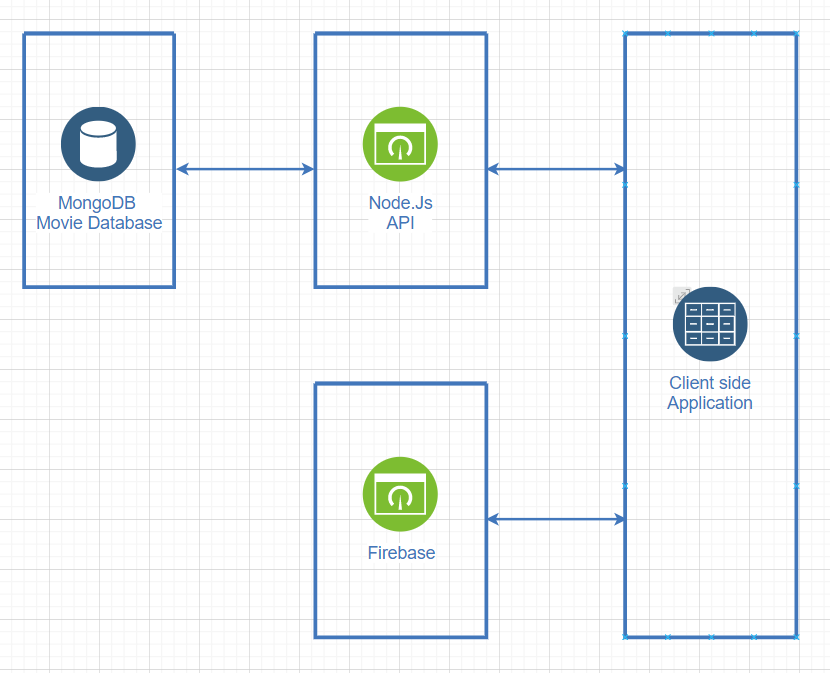

The general architecture consists of a MongoDB database for storing information about various movies. The database will then be reachable by using a Node.js API. On top of that Firebase will be used for user authentication as well as for storing user related information. The client side application will be based on React Native utilizing [renative framework](https://renative.org).

## 3.4. Wireframes

### Home page

Mobile            | Web
:-------------------------:|:-------------------------:
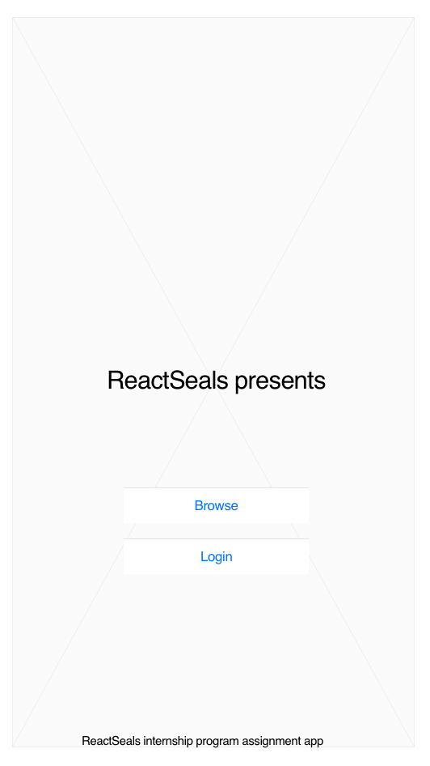  |  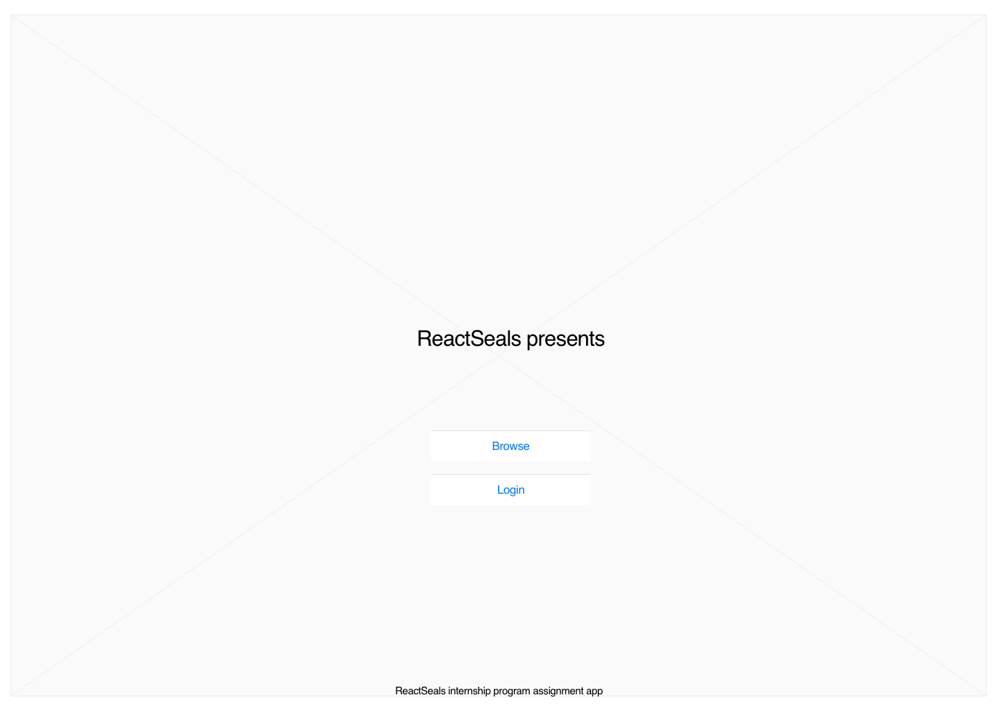

### Auth page 

Mobile            | Web
:-------------------------:|:-------------------------:
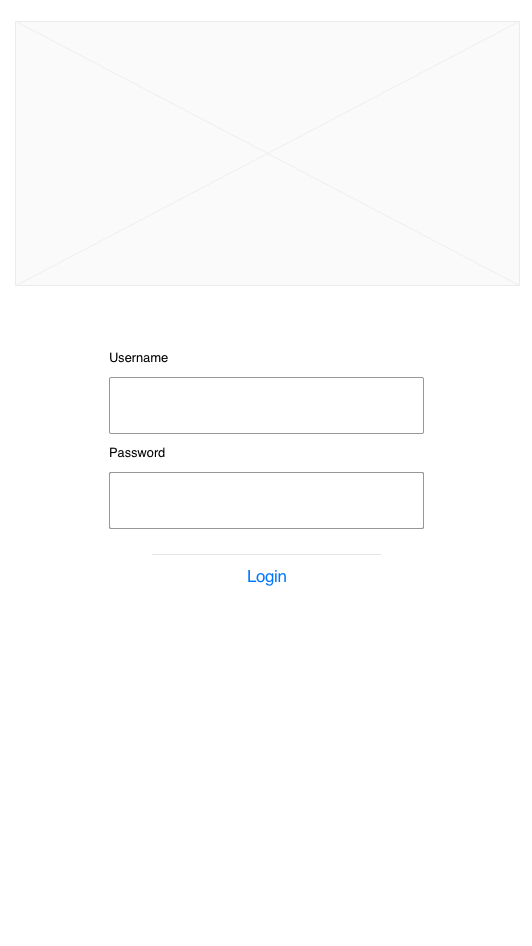  |  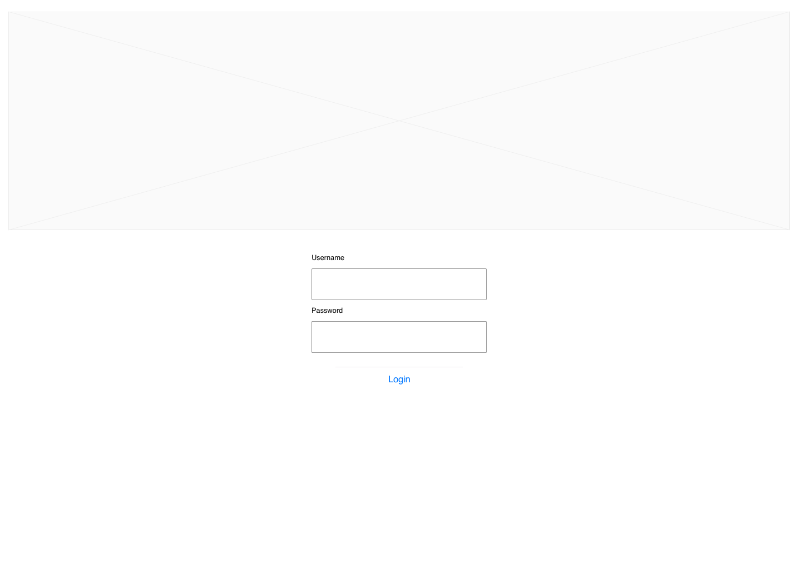

### Browse page

Mobile            | Web
:-------------------------:|:-------------------------:
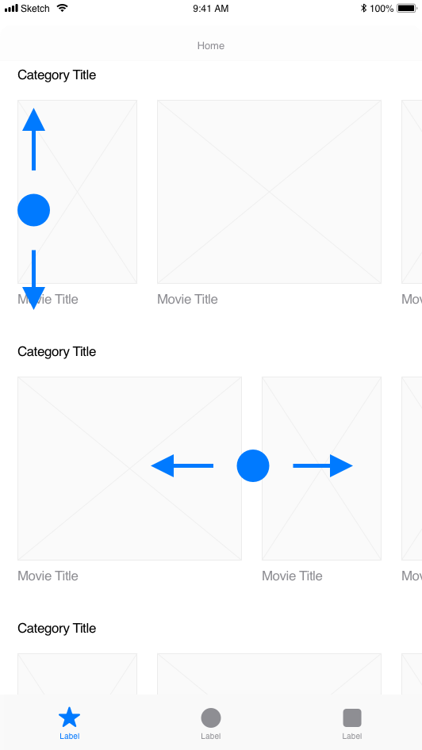  |  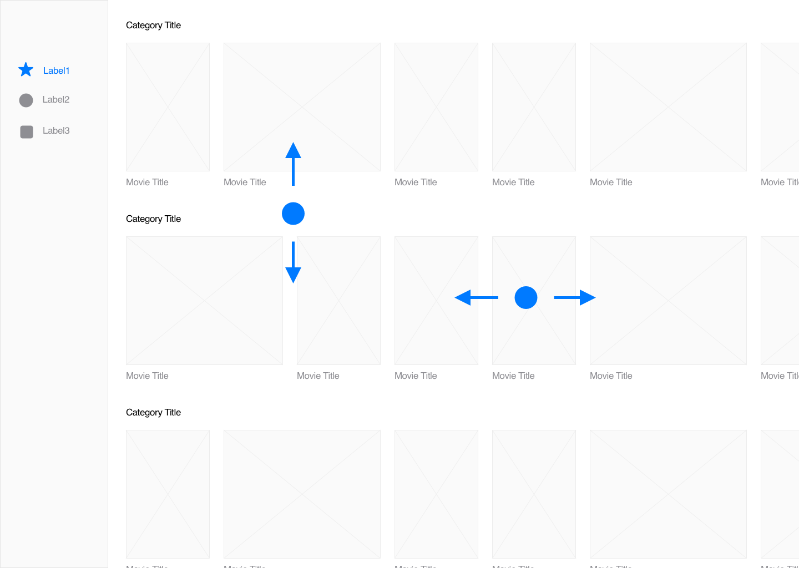

### Details page

Mobile            |  Web 
:-------------------------:|:-------------------------:
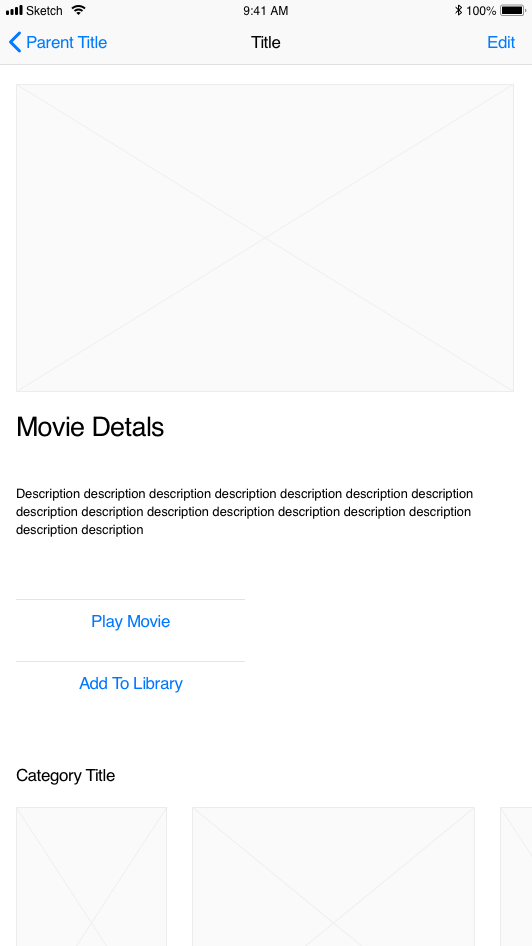  |  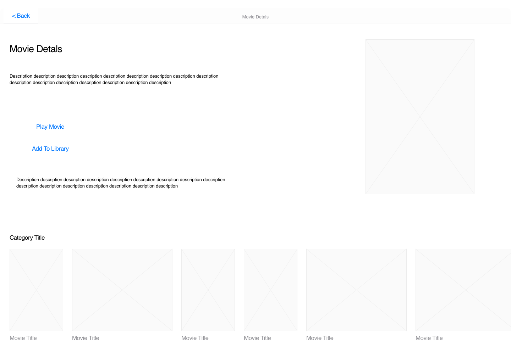

### Player page

Mobile            |  Web 
:-------------------------:|:-------------------------:
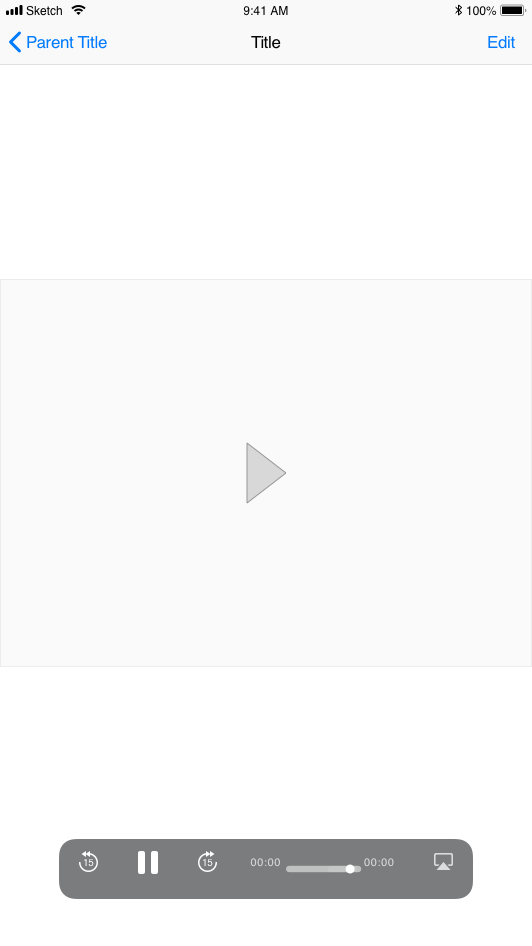  |  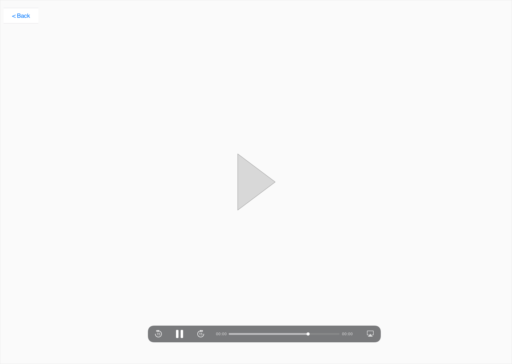

### Library page

Mobile            |  Web
:-------------------------:|:-------------------------:
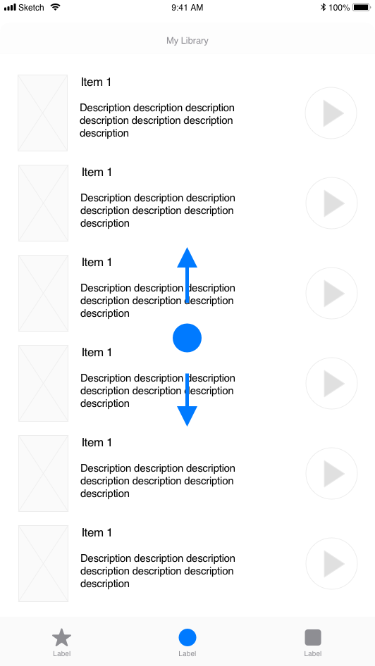  |  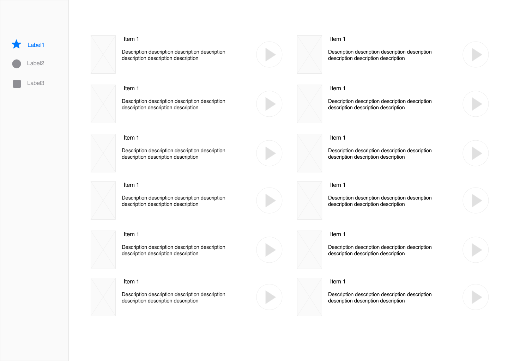

# 4. Results

Deadline of assignment is 1st of May. 
Send email to internships@reactseals.com with link to your repository and include your full name in email to be recognizible. If your repository is private one then assign https://github.com/aurimas535 to be able to preview your code.

What will be evaluated:
* Coding practises i.e. is code structurized, is linting were applied etc...
* Did you followed our provided requirements
* Creativity. Did you managed to deliver more than we are expecting
* Ability to adopt to new technologies. How fast you managed to complete the task

P.S. If you see that you can't finish everything on time, but you still have tangible part of assignment - send it to us that will be definitely evaluated.

P.S.S. If you have a question do not hesitate and create an issue straight in this repository it will be helpful for everyone. And we love when people are communicating!

Good luck!