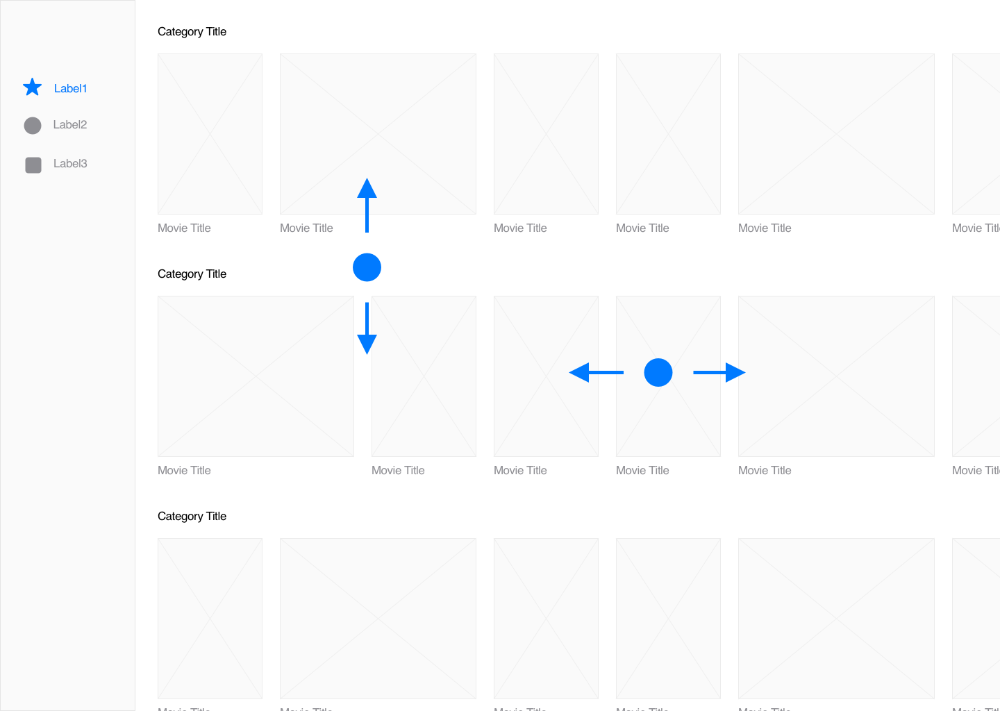
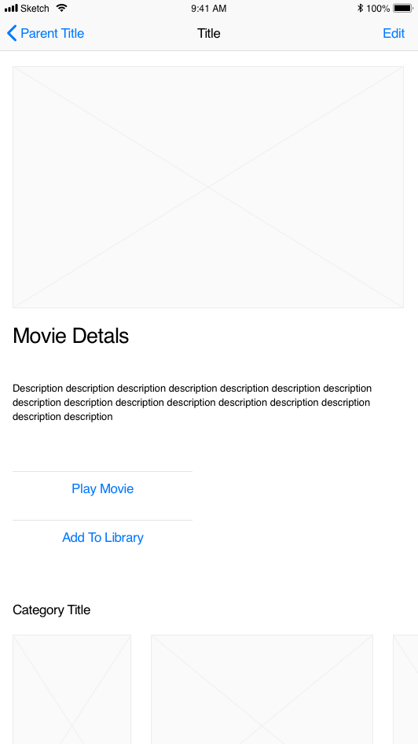
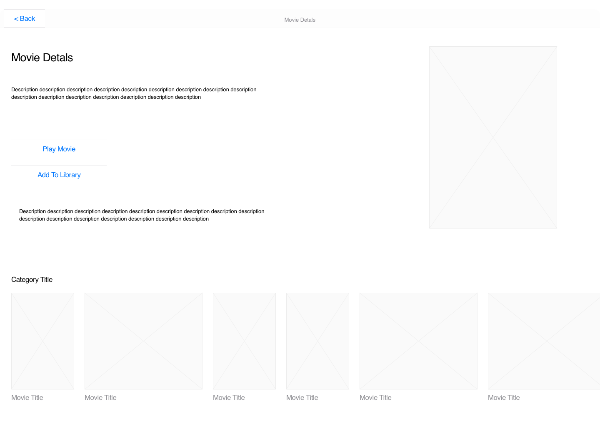
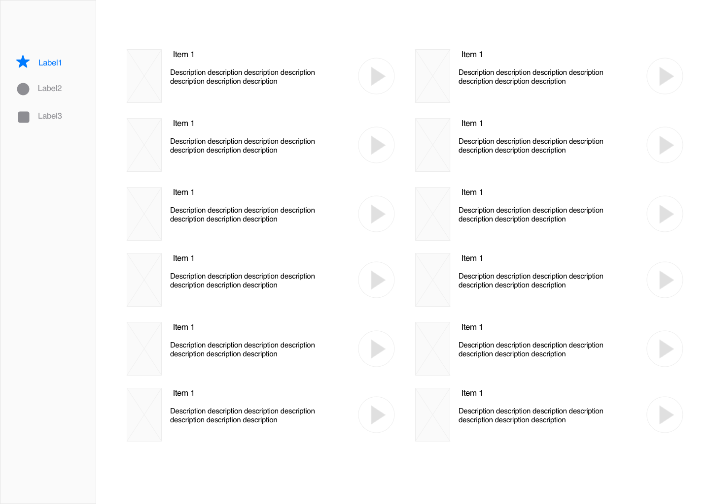

# 1. Introduction

In this document you will find developer assignment to ReactSeals Academy.

# 2. Goal

At the end of assignment you should have an end to end solution for reviewing movies. You will be creating a Backend API as well as client side solutions for Android and Web platforms.

# 3. Assignment
Create React Native application for Android and Web platforms utilizating https://renative.org/ framework.

The project can be modified as you see fit. There are no strict rules on how to implement features apart from the core functionality. Creativity and improvements are always welcomed and running the extra mile is something that would help you improve even further.

## 3.1. Requirements

* Use https://renative.org/ framework
* Android and Web platforms
* Node.js for backend part
* Mongo DB for database
* Firebase for user authentificaton
* Use github for code version control

## 3.2. Required functionality

* User registration and signing in
* [Browse page](#browse-page). Preview of three movie lists sorted by different categories. For example: the most popular movies, the latest movies, movies that will soon be shown in theater.
* [Details page](#details-page) Detailed preview of a single movie and a related movies tab for the selected movie.
* Preview of the trailer of the selected movie.
* [Library page](#library-page). A library where the user can add any selected movie.

## 3.3. Architecture

The general architecture consists of a MongoDB database for storing information about various movies. The database will then be reachable by using a Node.js API. On top of that Firebase will be used for user authentication as well as for storing user related information. The client side application will be based on React Native utilizing [renative framework](https://renative.org).

## 3.4. Wireframes

### Browse page

Mobile            | Web
:-------------------------:|:-------------------------:
  |  

### Details page

Mobile            |  Web 
:-------------------------:|:-------------------------:
  |  

### Library page

Mobile            |  Web
:-------------------------:|:-------------------------:
  |  

# 4. Results

Deadline of assignment is 1st of May.